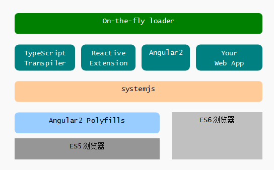
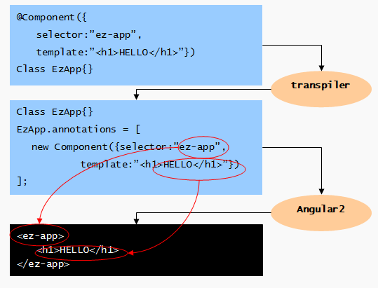
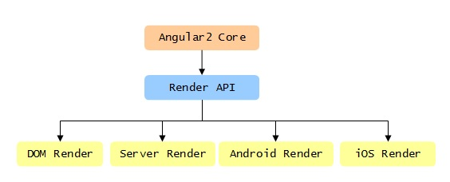
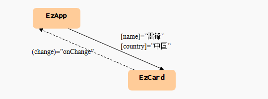
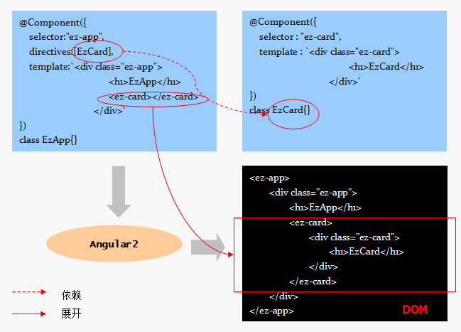
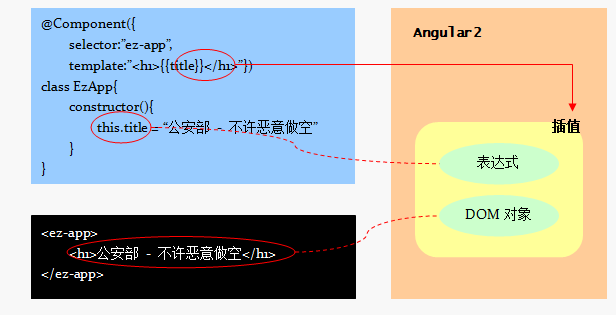
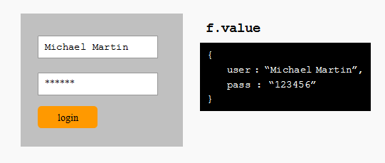
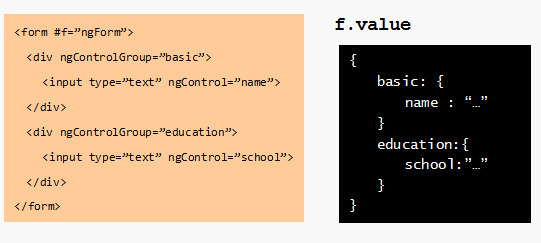
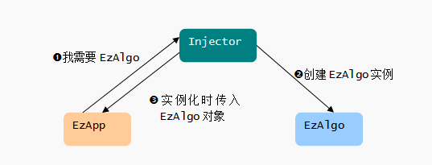

#Angular2入门

##快速上手

###Why Angular2

**性能的限制**

**快速变化的WEB**

`ECMAScript6` 标准完成

`Web组件`也将很快很快实现

**移动化**

**简单易用**

###ES6工具链

要让Angular2跑起来所需要的工具链：

Angular2是`面向未来`的科技，要求浏览器支持ES6+,我们现在要加一些`垫片`来抹平当前浏览器与ES6的差异：

- angular2 polyfills - 为ES5浏览器提供ES6特性支持，比如Promise等。
- systemjs - 通用模块加载器，支持AMD、CommonJS、ES6deng等各种格式的JS模块加载。
- typeScript - typeScript转码器，将TypeScript代码转换成当前浏览器支持的ES5代码。
- reactive extension - javascript 版本的反应式编程/Reactive Programming 实现库，被打包为systemjs包格式，以便systemjs动态加载。
- angular2 - Angular2框架，被打包为systemjs的包格式，以便systemjs动态加载模块。

###初始Angular2 

**1. 引入Angular2预定义类型**

    import {Component} from "angular2/core";
    import {bootstrap} from "angular2/platform/browser";
    
`import` 是ES6关键字，用来从模块中引入类型定义。

**2. 实现一个Angular2组件**

实现一个Angular2组件也很简单，定义一个类，然后给这个类添加注释：

    @Component({
        selector: 'ez-app',
        template: '<h1>Hello, Angular2</h1>'
    })
    class EzApp{}
    
class 用来定义一个类。@Component 是给类 EzApp 附加的元信息，被称为 `注解/Annotation`。

@Component 最重要的作用是:

1. 通过 selector 属性(值为CSS选择符)，告诉Angular2框架，这个组件渲染到哪个DOM对象上。
2. 通过 template 属性，告诉Angular2框架，使用什么模块进行渲染。

**3. 渲染组件到DOM**

将组件渲染到DOM上，需要使用 bootstrap 函数：

    bootstrap(EzApp)
    
###Annotation

ES6规范里没有装饰器。这其实是利用了 转码器提供的一个特性：注解。给一个类加注解，等同于设置这个类的 annotations属性：

    // 注解写法
    @Component({selector: "ez-app"})
    class EzApp{...}
    // 等同于
    class EzApp{...}
    EzApp.annotations = [new Component({selector: 'ez-app'})]
    
很显然，注释可以看做转码器层面的语法糖，但和Python的装饰器不同，注解在编译转码时仅仅被放在类对象的annotation属性里，编译器并不进行展开——这个解释的工作是Angular2框架完成的：

###小结
 
 **以组件为核心**
 
 **支持多种渲染引擎**
 
 以组件而非DOM为核心，意味着Angular2在内核隔离了对DOM的依赖 - DOM 仅仅作为一种可选的渲染引擎存在：
 
 
 
##组件开发 - 声明元数据
 
### selector - 声明选择符

使用 Component 注解的 selector 属性来告诉Angular2框架，当编译、链接模板时，如果看到这个选择符，就实例化一个组件对象。

slector 属性应当被指定为一个CSS选择符，比如：

**标签名选择符**

 @Component({selector:'ez-one', template:'TAGNAME-SELECTOR'})  
 class EzOne{}
 
将匹配： <ez-one></ez-one>

**CSS选择符**

**属性选择符**

**属性值选择符**

###template/templateUri - 声明模板

兼容HTML语法

在最简单的情况下，一个Angular2组件的模板由标准的HTML元素构成，看起来就是一段HTML码流。

    // 模板
    @Component({
        selector: 'ez-app',
        template: `<h1>hello</h1>
                    
...
`
    })
    class EzApp{}
    
    // DOM
    <ez-app>
        <h1>hello</h1>
        
...

    </ez-app>
    
有两种方法为组件指定渲染模板：

**1. 内联模板**

可以使用组件的 View注解 中的 template 属性直接指定内联模板：

    @Component({
        template : `<h1>hello</h1>
                    

`
    })
    
在ES6中，使用一对 ` 符号就可以定义多行字符串。

**2. 外部模板**

将模板写入一个单独的文件：

    <!-- ezcomp-tpl.html -->
    <h1>hello</h1>
    
...

    
在定义组件时，使用 templateUrl 引入外部模板:

    @Component ({
        templateUrl : 'ezcomp-tpl.html'
    })

###styles/styleUrls - 设置样式

有两种方法为组件设置CSS样式：

**1. 内联样式**

    @Component({
        styles:[`
            h1 {background:#4dba6c;color:#fff;}
        `]
    })
    
**2. 外部样式**

    /*ez-greeting.css*/
    h1 {background:#4dba6c;color:#fff}
    
    @Component({
        styleUrls: ['ez-greeting.css']
    })
    
###properties - 声明属性

`属性`是组件暴露给外部世界的调用接口，调用者通过设置不同的属性值来定制组件的行为与外观：

增加属性接口：

    //EzCard
    @Component({
        properties: ['name', 'country']
    }) 
    
上面的代码将组件的成员变量 name 和 country 暴露为 同名属性，这意味着在 EzApp 的模板中，可以直接使用 中括号 语法来设置 EzCard 对象的属性：

    // EzApp
    @Component({
        directives : [EzCard],
        template : `<ez-card [name]="'雷锋'" [country]="'中国'"></ez-card>`
    })
    
###events - 声明事件

与属性相反，事件从组件的内部流出，用来通知外部世界发生了一些什么事情：

在Angular2中为组件增加事件接口也非常简单：定义一个事件源/EventEmitter，然后通过Component注解的events接口暴露出来：

    // EzCard
    @Component({
        events:['change']
    })
    class EzCard{
        constructor(){
            this.change = new EventEmitter();
        }
    }
    
上面代码将组件EzCard的事件源 change 暴露为同名事件，这意味着在调用 EzApp 组件的模板中，可以直接使用小括号语法挂接事件监听函数：

    // EzApp
    @Component({
        template : '<ez-card (change)="onChange()"></ez-app>'
    })
    
每次EzCard触发change事件时， EzApp 的 onChange() 方法都将被调用。

###directive - 引用指令

在Angular2中，一个组件的模板内除了可以使用标准的HTML元素，也可以使用自定义组件！

建立自己的领域建模语言，这使得渲染模板和视图模型的对其更加容易，也使得模板的语意性更强：

**声明要在模板中使用的组件**

在使用自定义组件之前，必需在组件的Component注解中通过 directives 属性声明这个组件：

    @Component({
        directives: [EzComp],
        template: '<ez-comp></ez-comp>'
    })
    
directives 属性的值是一个数组，这意味着，你需要在这里声明所有你需要在模板中使用的自定义指令。

##组件开发 - 模板基本语法

###{{model}} - 文本插值

在模板中使用可以 {{表达式}} 的方式绑定组件模型中的表达式，当表达式变化时，Angular2将自动更新对应的DOM对象：

模板声明了 h1 的内容将绑定到组件实例的 title 变量。Angular2 框架将实时检测 title 的变化，并在其变化时自动更新DOM树中的h1的内容。

###[property] - 属性绑定

在模板中，也可以使用一对 中括号 将HTML元素或组件的属性绑定到组件模型的某个表达式，当表达式的值变化时，对应的DOM对象将自动得到更新。

    @Component({
        template: `<h1 bind-textCntent="title"></h1>`
    })
    
    // 等价于
    @Component({
        template: `<h1 [textContent]="title"></h1>`
    })
    
属性的值总是被当做调用者模型中的表达式进行绑定，当表达式变化时，被调用的组件自动得到更新。如果希望将属性绑定到一个常亮字符串，别忘了给字符串加引号，或者去掉去掉中括号：

   // 错误，Angular2将找不到表达式 Hello, ANgular2
   @Component({template: `<h1 [textContent]="Hello, ANgular2"></h1>`}) 
   // 正确， Angular2识别出常亮字符串表达式 'Hello, Angular2'
   @Component({template: `<h1 [textContent]="'Hello, Angular2'"></h1>`})
   // 正确， Angular2识别出常亮字符串作为属性textContent的值
   @Component({template: `<h1 textContent="Hello, Angular2"></h1>`})
   
###(event) - 事件绑定

    @view({template: `<h1 on-click="onClick()">HELLO</h1>`})
    
###var - 局部变量

添加一个以 # 或 var- 开始的属性，后续的部分表示 变量名，这个变量对应元素的实例。

    @Component({
        template: `
            <h1 #v_h1>hello</h1>
            <button click = "v_h1.textContent = 'HELLO'">test</button>
        `
    })
    
如果在一个组件元素上定义局部变量，那么其对应的对象为组件的实例：

    @Component({
        directives: [EzCalc],
        template: '<ez-calc #c></ez-calc>'
    })
    
在上面的示例中，模板内部的局部变量 c 指向 EzCalc 的实例。

##组件开发 - 在模板中使用预置指令

###NgStyle - 内联样式

我们可以使用样式绑定的方式设置单一样式。但如果同时设置多个样式值，可以使用 NgStyle 指令，将内联样式绑定到组件的属性上。

NgStyle 指令的选择符是 [ngStyle], 下面的示例将div元素的样式绑定到组件的 styles 属性：

    
...

    
styles 属性应当是一个JSON对象，其键为样式名，值为样式值：

    // EzApp class
    this.styles = {
        'color': 'red',
        'font-style': 'italic',
        'background-color': 'black'
    }
    
样式名可以使用HTML语法中的属性名写法(如上)，也可以使用JS语法中的 驼峰/camelCase 书写方法：

    // EzApp class
    this.styles = {
        color: 'red',
        fontSize: 'italic',
        backgroundColor: 'black'
    }
    
建议使用后一种写法。

###NgClass - 样式类

在Web App中我们通常采用动态添加或删除样式类的方法，来改变DOM元素的外观表现。

NgClass 指令的选择符是 ngClass ,下面示例将div元素的class属性绑定到组件的 cns属性：

    
...

    
cns 属性是一个JSON对象，每个键代表 样式类名，对应的值为true时表示向HTML元素添加该样式类，为false时表示删除该样式类。如果cns的值如下：

    // EzApp class
    this.cns = {
        colorful: true,
        italic: false,
        bold: true
    }
那么模板渲染后的结果是：

    
...

    
###NgIf - 条件逻辑

    @Component({
        template : `
            <!-- 根据变量 trial 的值决定是否显示广告图片 -->
            <templete [ngIf]= "trial == true">
                
            </template>
            <!-- 以下是正文 -->
            <pre>...</pre>
        `
    })
    
语法糖：

    // 使用template attribute
    
    // 使用*前缀
    
    
###NgSwitch - 分支逻辑

NgSwitch 包含一组指令，用来构造包含多分支的模板：

**NgSwitch**

    <ANY [ngSwitch]="expression">...</ANY>

**NgSwitchWhen**

    <ANY [ngSwitch]="...">
        <!-- 与变量比较 -->
        <template [ngSwitchWhen]="variable">...</template>
        <!-- 与常量比较 -->
        <template [ngSwitchWhen]="constant">...</template>
    </ANY>
    
**NgSwitchDefault**

    <ANY [ngSwitch]="...">
        <template ngSwitchDefault>...</template>
    </ANY>

###NgFor - 循环逻辑

**迭代**

    <template ngFor [ngForOf]="items">
        <li>------------</li>
    </template> 
    
**使用数据项**

    <template ngFor [ngForOf]="items" #item>
        <li>{{item}}</li>
    </template>
    
    items = ['China', 'India', 'USA']
    
    <li>China</li>
    <li>India</li>
    <li>USA</li>
    
**使用数据项索引**

    <template ngFor [ngForOf]="items" #item #i="index">
        <li>[{{i + 1}}] {{item}}</li>
    </template>
    
**语法糖**

    // 使用template attribute
    <ANY template="ngFor #item of items; #i=index">...</ANY>
    // 使用 * 前缀
    <ANY *ngFor="#item of items; #i=index">...</ANY>
    
##组件开发 - 在模板中使用pipe

###pipe

只是希望这个数据在展示的时候格式化一下，没必要修改控制类里的实现。更合理的处理方法是在表示层解决这个问题 - 在模板里改变数据的显示格式。

pipe的作用： 在模板中对输入数据进行变换，并输出变换后的结果。

    {{ data | <pipename>:<arg1>:</arg2> }}
    
我们使用预置的 DecimalPipe 对平均数进行处理，保留两位小数：

    
average : {{ avgScore() | number:'2.2-2' }}

    
这三个2分别表示最少整数位、最少小数位和最多小数位。

###预置pipe

除了 DecimalPipe, Angular2还预置了一下的pipe用来对常见数据类型进行转换：

**DatePipe** - 对日期/时间数据进行格式变换

    <!-- day:new Date('2016-03-14') 结果： '01/01/14' -->
    {{ day | date:'yyMMdd' }}
    
**JsonPipe** - 将JSON对象转换为字符串

在模板中使用 json 来引用 JsonPipe,其实实现基于 JSON.stringify()。

    <!-- '{x:1, y:2}' -->
    {{ {x:1, y:2}} | json }}
    
**PercentPipe** - 将数值转换为百分比

    <!-- 结果： 123.456% -->
    {{ 1.234567 | percent:'1.2-3'}}
    
**SlicePipe** - 提取输入字符串中的指定切片

    <!-- 结果: '123' -->
    {{ '0123456' | slice:1:4}}
    
**UpperCasePipe** - 将输入字符串变换为大写

uppercase

**LowerCasePipe** - 将输入字符串变换为小写

lowercase

###pipe级联

    <!-- 结果: 'WHAT' -->
    {{ "what a wonderful day!" | slice:0:4 | uppercase }}

###定制pipe

**1. 声明元数据**

    @Pipe({name: 'ezp'})
    class EzPipe{...}

Pipe注解为被装饰的类附加了管道元数据，其最重要的属性是name,也就是我们在模板中调用这个pipe时使用的名称。

    {{ data | ezp}}
    
**2. 实现transform方法**

pipe必须实现一个预定的方法 transform(input, args),这个方法的input参数代表输入数据，args代表输入参数，返回值将被作为管道的输出。

    @Pipe({name: 'ezp'})
    class EzPipe{
        transform(input,args){
            return input + ' ' + args.join(' ');
        }
    }

**3. 使用自定义管道 **

在使用自定义模板之前，需要预先声明一下，以便Angular2注入。

使用Component注解的pipes属性进行声明： pipes:[EzPipe]

    {{ 'call' | ezp:'john':'mary':'linda'}}
    
###有状态pipe

输出仅仅依赖输入的pipe，在Angular2中被称为 无状态管理/Stateless Pipe

但有些时候我们希望即使输入没有变化，也持续地检测管道的输出。如下：

    {{ 10 | countdown }}
    
默认情况下，Angular2框架仅仅执行一次pipe的 transform() 方法，我们需要使用 Pipe 注解的 pure 属性为false,要求Angular2框架在每个变化检查周期都执行pipe的transform() 方法：

    @Pipe({
        name: 'countdown',
        pure: false
    })
    class EzCountdown{...}

countdown pipe 的输入不仅依赖于输入，还依赖于其内部的运行状态。因此，这样的pipe，在Angular2中被称为 有状态管道/Stateful Pipe。

**注意**

pipe的有状态与无状态的区别，关键在于是否需要Angular2框架在输入不变的情况下依然持续地进行变化检测，而不是在于我们通常所指的计算的 幂等性 - 即同样的输入总是产生同样的输出。

###AsyncPipe

AsyncPipe 是 Angular2 框架预置的一个有状态管道，它的输入是一个异步对象：Promise对象、Observable对象或者EventEmitter对象。

每当异步对象产生新的值，AsyncPipe会返回这个新值，因此，AsyncPipe需要Angular2框架持续进行变化检测，它的 Pipe 注解的 pure属性值为 false。

    @Pipe({name: 'countsown'})
    class EzCountdown{
        transform(input) {
            var counter = input;
            return new Observable(o => {
                setInterval(_ => {
                    o.next(counter);
                    counter--;
                    if(counter<0) o.complete();
                }, 1000)
            })
        }    
    }

现在EzCountdown是一个无状态的pipe,它返回一个Observable对象，我们在模板中使用AsyncPipe来继续处理这个对象：

    {{ 10 | countdown | async }}   

##组件开发 - 在模板中处理表单输入

**NgForm - 表单指令**

NgForm 指令为 表单元素/form建立一个控件组对象，作为控件的容器；
而NgControlName指令则为宿主input元素建立一个控件对象，并将该控件加入到ngForm指令建立的控件组中：

**局部变量**

通过使用 # 符号，我们创建了一个引用控件组对象的局部变量 f 。这个变量最大的作用是: 它的 value 属性是一个简单的JSON对象，键对应于 input 元素的 ng-control 属性，值对应于 input 元素的值：

**声明指令依赖**

###NgControlName - 命名控件指令

NgControlName 指令必须作为NgForm或NgFormModel的后代使用，因为这个指令需要将创建的控件对象添加到祖先（NgFrom 或 NgFormModel）所创建的控件组中。

NgControlName指令的选择符是 [ngControl] ，这意味着你必须在一个HTML元素上定义 ngControl 属性，这个指令才会起作用。

**属性：ngControl**

NgControlName 指令为宿主的DOM对象创建一个控件对象，并将这个对象以 ngControl 属性 指定的 名称 绑定到DOM对象上：

    <form #f="ngForm">
        <input type="text" ngControl="user" />
        <input type="password" ngControl="pass"
    </form>
    
**属性/方法: ngModel**

除了使用 控件组 获得输入值，NgControlName 指令可以通过 ngModel 实现模型与表单的双向绑定：

    <form>
        <input type="text" ngControl="user" [(ngModel)]="data.user" />
        <input type="password" ngControl="pass" [(ngModel)]="data.pass" /> 
    </form>

ngModel 即是NgControlName指令的属性，也是它的事件，所以下面的两种写法是等价的：

    <input type="text" ngControl="user" [(ngModel)]="data.user" >
    // 等价于
    <input type="text" ngControl="user" [ngModel]="data.user" (ngModel)="data.user" >
    
###NgControlGroup - 命名控件组

NgControlGroup指令的选择符是 [ng-control-group] ,如果模板中的某个元素具有这个属性，Angualar2框架将自动创建一个控件组对象，并将这个对象y
以指定的名称与DOM对象绑定。

和NgControlName指令一样，NgControlGroup指令也必须作为NgForm或NgFormModel的后代使用，这个指令需要将创建的控件组对象添加到祖先所创建的控件组中。

###NgFormControl - 绑定已有控件对象

当需要对输入的值进行初始化时，可以使用NgFormControl指令。

使用NgFormControl指令将DOM元素绑定到组件EzComp的成员变量 movie 上，我们需要在构造函数中先创建这个 Control 对象：

    @View({
        // 将输入元素绑定到已经创建的控件对象上
        template: `<input type="text" [ngFormControl]="movie >`
    })
    
    class EzComp{
        constructor(){
            // 创建控件对象
            this.movie = new Control('Matrix II - Reload')
        }
    }
    
与NgControlName指令的另一个区别是，NgFormControl不需要NgForm或NgFormModel的祖先。

###NgFormModel - 绑定已有控件组

NgFormModel 指令类似于 NgControlGroup 指令，都是为 控件 提供容器。但区别在于，NgFormModel指令将已有的控件组绑定到DOM对象上：

    @View({
        template: `
            <!-- 绑定控件组与控件对象 -->
            

                <input type="text" ngControl="name" >
                <input type="text" ngControl="age" >
            

        `
    })
    class EzComp{
        contructor(){
            // 创建控件组及控件对象
            this.controls = new ControlGroup({
                name: new Control('Jason'),
                age: new Control('45')
            })
        }
    }
    
NgFormModel 指令可以包含NgControlGroup指令，以便将不同性质的输入分组。

##指令开发 - 增强HTML功能

**Directive - 定义指令元数据**

指令是Angular对HTML进行扩展的基本手段。与Angular1.x不同，在Angular2中，指令被明确地划分为三种类型：

- 组件 - 组件其实就是带有模板的指令
- 属性指令 - 属性指令用来改变所在元素的外观或行为，例如NgClass和NgStyle指令
- 结构指令 - 结构指令用来向DOM中添加或删除元素，例如NgIf和NgFor指令。

组件使用 Component 注解来装饰组件类，而属性指令和结构指令则使用 Directive 注解来装饰指令类。

**1. Directive注解 - 声明指令元数据**

Directive 注解最重要的属性是 selector：

    @Directive ({selector:"ez-h"})
    class EzHilight{...}

    
...<?div>
    
**2. ElementRef - 获取指令所在DOM对象**

我们需要在EzDirective类的实现中进行DOM操作，这需要告诉Angular2框架向我们注入 ElementRef 对象，其 nativeElement 属性就是对应的DOM对象：

    class EzHilight{
        constructor(@Inejct(ElementRef) elref){
            this.el = elref.nativeElement; //获取指令所在的DOM元素
            this.el.styles.color = "red";  // 进行DOM操作
        }
    }
    
**3.使用自定义指令**

如果要在组件中使用自定义指令，需要在Component注解中设置directives属性：

    @Component({
        selector: 'ez-app',
        template: '
...
',
        directives: [EzHilight]
    })
    class EzApp{}
    
###inputs - 声明属性值映射

将指令所在的DOM对象的背景设置为指定颜色：

    
...

    
    @Directive({
        selector: "[ez-h]",
        inputs: ["bgColor:ez-h"]
    })
    class EzHilight{...}
    
当在模板中使用这个指令时，EzHilight对象的 bgColor 属性自动绑定到模板中 div 元素的 ez-h 属性的值。对于指令而言，这是一个输入，每当 ez-h发生变化，Angular2将自动设置 EzHilight 的 bgColor属性。

###host - 声明事件监听

host属性

    // 指令将监听所在DOM元素的 click 和 mouseover
    @Directive({
        selector: "[ez-h]",
        host:{
            '(click)': 'onMyClick()',
            '(mouseover)': 'onMyMouseOver()'
        }
    })
    class EzHilight{...}
    
host 属性的值应当是一个JSON对象，其键为一对小括号包裹的事件名称，书写方法与在模板中一致；值为事件处理表达式，通常是对指令类中方法的调用。

    class EzHilight{
        onMyClick(){...}
        onMyMouseOver(){...}
    }
    
###renderer - 使用渲染器

在Angular2中，引入了渲染器/renderer的概念，它定义了一组规范的接口Renderer,对于不同的平台，有不同的实现。比如，对于浏览器，对应的Renderer实现是DomRenderer。

在指令的构造函数中，我们可以要求Angular2框架注入当前使用的渲染器对象：

    class EzHilight{
        constructor(@Inject(Element) el,@Inject(Renderer) renderer){
            this.el = el;
            this.renderer = renderer;
        }
    }
    
Angular2希望我们使用Renderer来代替直接的DOM操作，这将保证我们的代码获得跨平台性。

    class EzHilight{
        set bgColor(v){
            this.renderer.setElementStyle(this.el, 'background', v)
        }
    }
    
##服务开发 - 封装与注入

###服务 - 封装可复用代码

在Angular2中，服务用来封装可复用的功能代码。

Angular2中实现一个服务非常简单直接： 定义一个类，然后，它就是服务：

    class EzAlgo{
        add(a,b) {return a+b}
        sub(a,b) {return a-b}
    }

###注入服务 - providers

我们可以使用Angular2的 注入器/Injector 进行解耦：

注入器就像婚姻介绍所，男方在婚介所登记心仪女性特点，约好见面地点，然后，坐等发货即可。

    @Component({
        providers: [EzAlgo]   // 声明依赖
    })
    class EzApp{
        // Angular2 框架负责注入对象
        constructor(@Inject(EzAlgo) algo){
            // 已经获得EzAlgo实例！
        }
    }
    
###Injector - 注入器

    

